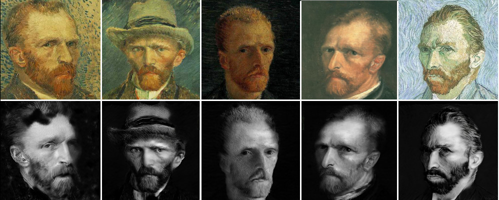
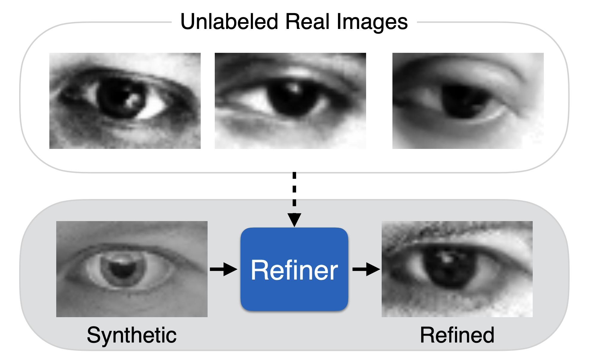

During my undergraduate Economics program, I took one game theory course. At that time, I couldn't imagine that it would be applied to machine learning. I recently listened to one podcast and watched one talk of Ian Goodfellow (the inventor of GAN) and I was impressed when he explained the GANs in the language of **game theory**.

## What is the "Game" in the adversarial training?

Players: The design of the architecture is like a two-player **minimax game**: one is a generator, one discriminator.

One example game in the computer vision domain: The generator produces images (random pixels in its first try) and discriminator predicts whether the image is real or fake. There is an adversarial competition between them. The generator tries to fool the discriminator. Both the generator and the discriminator are trained simultaneously. 

End of the game: We hope that they reach a Nash equilibrium where the generator can no longer produce better images, and discriminator can do no better than random guessing. In this equilibrium, we come up with a model that can generate new samples from the distribution. In other words, it will create visually appealing and convincing results.

## What can it do?

There are many types of GANs. It is especially popular in the computer vision domain. Some examples:

- [SRGAN](https://arxiv.org/abs/1609.04802) upscales low-resolution images
- [CycleGAN](https://junyanz.github.io/CycleGAN/) does domain transfer (ie: from drawing to photo-realistic images)
- [StyleGAN](https://github.com/NVlabs/stylegan) produces super-realistic portrait photos
etc.

Here is my attempt to create photorealistic portraits of Van Gogh by using CycleGAN.

## What Else Can It Do?
Here are a few applications in different domains:

### 1. Security
A system that generates some sound, which is a just random noise for you but an executable command for your phone (Ian Goodfellow, the inventor of GANs, mentioned in the Artificial Intelligence Podcast). The attacker's model simply tries to minimize its error rate and maximize the error rate of your model.

In general, most of the ML models assume that the inputs are attack-free (i.i.d. assumption), and they can easily be fooled with adversarial examples. So, they simply need defense mechanisms like relaxing identical and independent assumptions and some other solutions. (1)

### 2. Simulating Training Data
Assume that you need to train a model but getting input data is difficult or costly. You have a chance to generate them with 3D software but the output looks synthetic. GANs can make those synthetic inputs realistic. Below is an illustration from  Learning from Simulated and Unsupervised Images through Adversarial Training paper.

### 3. Extreme Reliability
There are applications where 99 % accuracy is not good enough (assume a disaster with a probability of 1%). For such cases, GANs can serve as a stress testing mechanism.

## Summary

In most of the applications, the results are not perfect. However, the idea itself is very interesting. As someone interested in painting and arts, I am impressed when I saw some applications in image/photo processing. The idea impressed me the second time when I found some possible applications in other domains.

## References
- (1) A Research Agenda: Dynamic Models to Defend Against Correlated Attacks - Ian Goodfellow, 2019